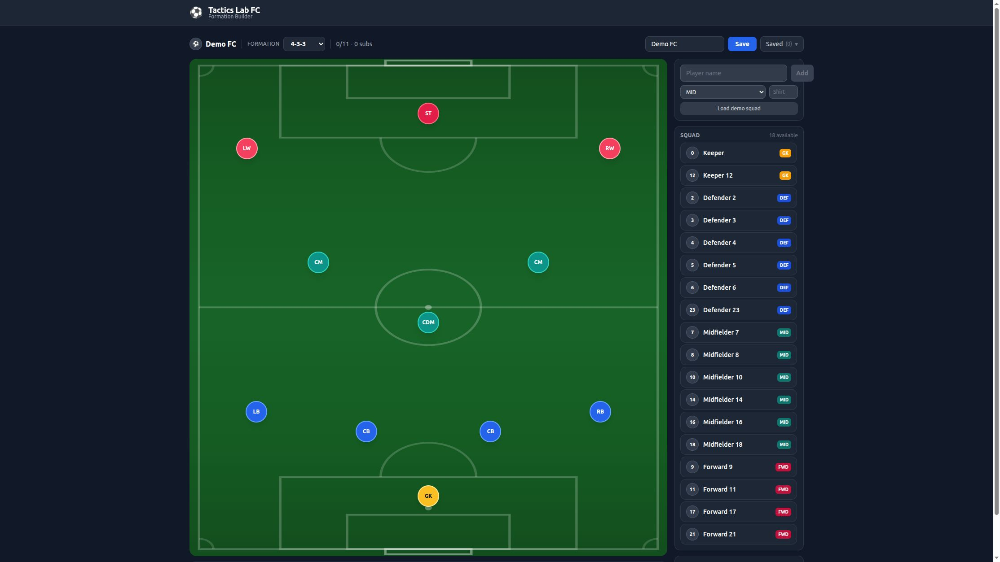

# Tactics Lab FC

Football tactics board: drag-and-drop formations, per-slot roles, a substitutes bench, and save/load in the browser.

**[Live demo](https://alexgarbi10.github.io/tactics-lab-fc/)**



Add named players (or load a generic demo squad), assign them to a pitch, set roles like Box-to-Box or Mezzala, and save the setup locally. No account. The live demo does not call API-Football.

## Stack

React 19 · Vite · TypeScript · Tailwind CSS

An optional Fastify + MongoDB server lives in `server/` for a future live club-search backend. The published demo is client-only.

## Features

- 10 presets: 4-3-3, 4-4-2, 4-2-3-1, 3-5-2, 3-4-3, 5-3-2, 4-1-4-1, 4-3-2-1, 4-5-1, 3-6-1
- Add players by name, position, and shirt number (0–999; 1–99 is typical)
- Generic demo squad (role labels, not real people)
- Click or drag onto pitch slots; click a node for role and shirt
- Bench up to 9; drag nodes to tweak position
- Save / load / delete in `localStorage`

## Run locally

Node.js 18+ and pnpm 10+ required.

```bash
pnpm install
pnpm dev         # http://localhost:5173
pnpm test
pnpm build
```

`pnpm dev:full` also starts the optional API on port 3000. The UI does not need it for the demo.

## License

GNU General Public License v3.0 — see [LICENSE](LICENSE).
